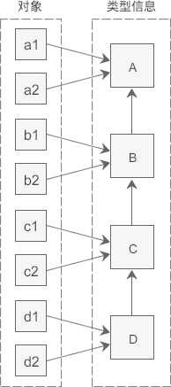

## C++ Notes

> [Mocrosoft C++ Reference](https://docs.microsoft.com/zh-cn/cpp/cpp/cpp-language-reference?view=msvc-170)

> [Cplusplus Reference](https://www.cplusplus.com/)

### Variables

#### Fundamental data types

<table>
<thead>
  <tr>
    <th>Group</th>
    <th colspan="2">Type names</th>
    <th colspan="2">Notes on size / Precision</th>
  </tr>
</thead>
<tbody>
  <tr>
    <td rowspan="4">Character types</td>
    <td colspan="2">char</td>
    <td colspan="2">Exactly one byte. At least 8 bits</td>
  </tr>
  <tr>
    <td colspan="2">char16_t</td>
    <td colspan="2">&gt; char. At least 16 bits</td>
  </tr>
  <tr>
    <td colspan="2">char32_t</td>
    <td colspan="2">&gt; char16_t. At least 32 bits</td>
  </tr>
  <tr>
    <td colspan="2">wchar_t</td>
    <td colspan="2">Can represent the largest supported char set</td>
  </tr>
  <tr>
    <td rowspan="5">Integer types signed</td>
    <td colspan="2">signed char</td>
    <td colspan="2">= char. At least 8 bits</td>
  </tr>
  <tr>
    <td colspan="2">signed short</td>
    <td colspan="2">&gt; char. At least 16 bits</td>
  </tr>
  <tr>
    <td colspan="2">signed int</td>
    <td colspan="2">&gt;= short. At 16 bits</td>
  </tr>
  <tr>
    <td colspan="2">signed long</td>
    <td colspan="2">&gt; int. At least 32 bits</td>
  </tr>
  <tr>
    <td colspan="2">signed long long</td>
    <td colspan="2">&gt; long. At least 64 bits</td>
  </tr>
  <tr>
    <td rowspan="5">Integer types unsigned</td>
    <td colspan="2">unsigned char</td>
    <td colspan="2" rowspan="5">Same size as their signed counterparts</td>
  </tr>
  <tr>
    <td colspan="2">unsigned short</td>
  </tr>
  <tr>
    <td colspan="2">unsigned int</td>
  </tr>
  <tr>
    <td colspan="2">unsigned long</td>
  </tr>
  <tr>
    <td colspan="2">unsigned long long</td>
  </tr>
  <tr>
    <td rowspan="3">Floating-point types</td>
    <td colspan="2">float</td>
    <td colspan="2"></td>
  </tr>
  <tr>
    <td colspan="2">double</td>
    <td colspan="2">Precision &gt; float</td>
  </tr>
  <tr>
    <td colspan="2">long double</td>
    <td colspan="2">Precision &gt; double</td>
  </tr>
  <tr>
    <td>Boolean types</td>
    <td colspan="2">bool</td>
    <td colspan="2"></td>
  </tr>
  <tr>
    <td>Void type</td>
    <td colspan="2">void</td>
    <td colspan="2">No storage</td>
  </tr>
  <tr>
    <td>Null pointer</td>
    <td colspan="2">decltype(nullptr)</td>
    <td colspan="2"></td>
  </tr>
</tbody>
</table>

#### Type deduction: `auto` and `decltype`

```cpp
#include <iostream>
#include <typeinfo>

int a = 0;
auto b = a; // same as: int b = a;

decltype(a) b; // same as: int b;

std::cout << typeif(a).name() << std::endl;
std::cout << typeif(b).name() << std::endl;
```

##### `auto` vs. `decltype`

`auto` discards qualified properties of variable, but `delctype` remains them. e.g.

```cpp
const int a = 1;
auto b = a;  // auto discards const property, and this is same as: int b = a;
decltype(a) c;  // delctype remains const property: const int c;
```

> `const` and `volatile` are antonym.

> `const` means variable is readonly.

> `volatile` means variable is easy to be changed, which means compiler will keep it in cpu register to optimize performance.

```cpp
int a = 10;
int &ra1 = a;

auto ra2 = ra1;
ra2 = 20;
// a: 10, ra1: 10, ra2: 20

decltype(ra) ra3 = 30;
// a: 30, ra1: 30, ra3: 30
```

For reference, `auto` still discards variable's qualified property, deducing variable type to its origin type (`int`). Butt `decltype` remains its reference property(`int &`).

#### Type conversion

> [Reference](http://c.biancheng.net/cpp/biancheng/view/3297.html)

##### Implicit casting

```cpp
short a = 1;
int b = a;
```

##### Explicit casting

```cpp
auto b = (int*)a;
```

##### `static_cast`

1. Process conversion during **compiling**. If conversion failed, throw a compiling error. In runtime period, it doesn't incur type-safety check like `dynamic_cast`.

2. Mainly usage:
    - Built-in type conversion, e.g. `short` => `int`, `int` => `double`, etc.
    - Upcasting (pointer-to-derived => pointer-to-base).
    - `void*` => concrete pointer, e.g. `void*` => `int*`, `cahr*` => `void*`, etc.
    - Convert class with converting constructor and type-casting function.

3. Cannot convert:
    - No-related concrete **pointer**, e.g. `int*` => `double*`, because their storage structure in memory is totally different.
    - `int` and pointer, becuase a user-defined number seldom correctly mapping to a valid memory address.
	- convert `const` or `volatile` => `non-const` or `non-volatile` type.

    ```cpp
    #include <iostream>
    #include <cstdlib>
    using namespace std;

    class Complex {
    public:
        // 默认构造函数
        Complex(double real = 0.0, double imag = 0.0) 
		        : m_real(real), m_imag(imag) { }

        // 转换构造函数
        inline Complex(int num) { m_real = static_cast<double>(num); }

    public:
        //类型转换函数
        inline operator double() const { return m_real; }

    private:
        double m_real;
        double m_imag;
    };

    int main() {
        //下面是正确的用法
        int m = 100;
        Complex c(12.5, 23.8);
        long n = static_cast<long>(m);  //宽转换，没有信息丢失
        char ch = static_cast<char>(m);  //窄转换，可能会丢失信息

        //将void指针转换为具体类型指针
        int *p1 = static_cast<int*>( malloc(10 * sizeof(int)) );

        //将具体类型指针，转换为void指针
        void *p2 = static_cast<void*>(p1);
        double real= static_cast<double>(c);  //调用类型转换函数
        Complex c1 = static_cast<Complex>(m);

        //下面的用法是错误的
        //不能在两个具体类型的指针之间进行转换
        // float *p3 = static_cast<float*>(p1);

        //不能将整数转换为指针类型
        // p3 = static_cast<float*>(0X2DF9);
    
        return 0;
    }
    ```

##### `const_cast`

Convert `const` or `volatile` to `non-const` or `non-volatile`

```cpp
#include <iostream>
using namespace std;

int main() {
    const int n = 100;
    int *p = const_cast<int*>(&n);
    *p = 234;
    cout<<"n = "<<n<<endl;
    cout<<"*p = "<<*p<<endl;

    return 0;
}
```

##### `dynamic_cast`

1. `dynamic_cast<newType>(expr)` 

    `newType` and `expr` must be pointer or reference at the same time, meaning that `dynamic_cast` can only convert pointer or reference, instead of `int`, `double`, `class` or `struct`.

2. `dynamic_cast` is opposite with `static_cast`, the former processes type-safety check and conversion using RTTI during runtime.

3. `dynamic_cast` can achieve both upcasting and downcasting, but needs **base class contains virtual function**. After converted, program reaches variable function according to **virtual function table**.

4. Upcasting (Base <= Derived)

    Unconditionally succeed, because RTTI can always find effective base class for derived class in the inheritance chain. Type-safety check won't be triggered at this scenario, at which `dynamic_cast` is like `static_cast`.

    ```cpp
    #include <iostream>
    #include <iomanip>
    using namespace std;
    
    class Base{
    public:
        Base(int a = 0): m_a(a){ }
        int get_a() const{ return m_a; }
        virtual void func() const { }
    protected:
        int m_a;
    };
    
    class Derived: public Base{
    public:
        Derived(int a = 0, int b = 0): Base(a), m_b(b){ }
        int get_b() const { return m_b; }
    private:
        int m_b;
    };
    
    int main(){
        //情况1
        Derived *pd1 = new Derived(35, 78);
        Base *pb1 = dynamic_cast<Derived*>(pd1);
        cout<<"pd1 = "<<pd1<<", pb1 = "<<pb1<<endl;
        cout<<pb1->get_a()<<endl;
        pb1->func();
    
        //情况2
        int n = 100;
        Derived *pd2 = reinterpret_cast<Derived*>(&n);
        Base *pb2 = dynamic_cast<Base*>(pd2);
        cout<<"pd2 = "<<pd2<<", pb2 = "<<pb2<<endl;
        cout<<pb2->get_a()<<endl;  //输出一个垃圾值
        pb2->func();  //内存错误
    
        return 0;
    }
	```

5. Downcasting (Base => Derived)

    Program, according to inheritance chain, determins conversion successful or not.

    ```cpp
    #include <iostream>
    using namespace std;
    
    class A{
    public:
        virtual void func() const { cout<<"Class A"<<endl; }
    private:
        int m_a;
    };
    
    class B: public A{
    public:
        virtual void func() const { cout<<"Class B"<<endl; }
    private:
        int m_b;
    };
    
    class C: public B{
    public:
        virtual void func() const { cout<<"Class C"<<endl; }
    private:
        int m_c;
    };
    
    class D: public C{
    public:
        virtual void func() const { cout<<"Class D"<<endl; }
    private:
        int m_d;
    };
    
    int main(){
        A *pa = new A();
        B *pb;
        C *pc;
       
        //情况1
        pb = dynamic_cast<B*>(pa);  //向下转型失败
        if(pb == NULL){
            cout<<"Downcasting failed: A* to B*"<<endl;
        }else{
            cout<<"Downcasting successfully: A* to B*"<<endl;
            pb -> func();
        }
        pc = dynamic_cast<C*>(pa);  //向下转型失败
        if(pc == NULL){
            cout<<"Downcasting failed: A* to C*"<<endl;
        }else{
            cout<<"Downcasting successfully: A* to C*"<<endl;
            pc -> func();
        }
       
        cout<<"-------------------------"<<endl;
       
        //情况2
        pa = new D();  //向上转型都是允许的
        pb = dynamic_cast<B*>(pa);  //向下转型成功
        if(pb == NULL){
        cout<<"Downcasting failed: A* to B*"<<endl;
        }else{
            cout<<"Downcasting successfully: A* to B*"<<endl;
            pb -> func();
        }
        pc = dynamic_cast<C*>(pa);  //向下转型成功
        if(pc == NULL){
            cout<<"Downcasting failed: A* to C*"<<endl;
        }else{
            cout<<"Downcasting successfully: A* to C*"<<endl;
            pc -> func();
        }
       
        return 0;
    }
	```

	

##### `reinterpret_cast`

As its name implies, **re-interpret** binary bits in memory, regardless of conversion rules for data, risking a lot.

`reinterpret_cast` is often as supplement of `static_cast` to force converting variables.

```cpp
#include <iostream>
using namespace std;

class A{
public:
    A(int a = 0, int b = 0): m_a(a), m_b(b){}
private:
    int m_a;
    int m_b;
};

int main(){
    //将 char* 转换为 float*
    char str[]="http://c.biancheng.net";
    float *p1 = reinterpret_cast<float*>(str);
    cout<<*p1<<endl;
    //将 int 转换为 int*
    int *p = reinterpret_cast<int*>(100);
    //将 A* 转换为 int*
    p = reinterpret_cast<int*>(new A(25, 96));
    cout<<*p<<endl;
   
    return 0;
}
```

### Flow control

#### `condition ? expr1 : expr2`

```cpp
condition 
    ? expr1
    : expr2;
```

#### `if-else`

```cpp
if (condition0) {
    // code ...
}
else if (condition1){
    // code ...
}
else {
    // code ...
}
```

#### `switch`

```cpp
switch(enum_condition) {
    case enum0: {
        // code ...
        break;
    }
    case enum1:
    case enum2:
    case enum3: {
        // code ...
        break;
    }
    default:
        // code ...
        break;
}
```

#### `while`

```cpp
while(condition) {
    // code ...
}

do {

} while(condition);
```

#### `for`

```cpp
// Basic for loop
for (std::size_t i = 0; i < vec.size(); ++i) {
    // code ...
}

// iter can be changeable loop
for (auto iter  = vec.begin(); iter != vec.end(); ++iter) {
    // code ...
}

// iter is const
for (auto iter = vec.cbegin(); iter != vec.cend(); ++iter) {
    // code ...
}

// range for loop, changeable
for (auto &iter : vec) {
    iter = ...;
}

// ange for loop, unchangeable
for (const auto &iter : vec) {
    // readonly operation ...
}
```

### Functions

#### Normal function

- Declaration

```cpp
// Before C++11
return_value function_name(para1, para2, ...);

// C++11 or newer
auto function_name(para1, para2, ...) -> return_value;
```

- Definition

```cpp
// Before C++11
return_value function_name(para1, para2, ...) {
    // code ...

    return ...;
}

// C++11 or newer
auto function_name(para1, para2, ...) -> return_value {
    // code ...

    return ...;
}
```

- Call

```cpp
receptor = function_name(para1, para2, ...);
```

#### `main` function

The entry of program.

```cpp
// Before C++11
int main(int argv, char** argc) {

    return ...;
}

// C++11 or newer
auto main(int argv, char** argc) -> int {

    return ...;
}
```

About return value of `main`:

|     Value    | Description                                                         |
|:------------:|---------------------------------------------------------------------|
|       0      | The program was successful                                          |
| EXIT_SUCCESS | The program was successful (same as above). Defined in `<cstdlib>`. |
| EXIT_FAILURE | The program failed. Defined in `<cstdlib>`.                         |

#### `inline` function

- Declaration

```cpp
// Before C++11
inline return_value function_name(para1, para2, ...);

// C++11 or newer
inline auto function_name(para1, para2, ...) -> return_value;
```

- Definition

```cpp
// Before C++11
inline return_value function_name(para1, para2, ...) {

    return ...;
}

// C++11 or newer
inline auto function_name(para1, para2, ...) -> return_value {

    return ...;
}
```

#### lambda function

- Definition

```cpp
auto function_name = [capture_list](para1, para2, ...) -> return_value {

    return ...;
}
```

In capture_list, `=` means parameters passed by value, `&` means that passed by reference.

Capture value may entail parameter duplication occurred, when that is complicated data type will take much time to archive duplicating process.

The cost of capture reference is much cheaper, thanks of reference machanism.

### Try / Catch / Exception

```cpp
auto main(int argc, char **argv) -> int {
    try {
        // code ...
        throw std::exception("Built-in error type");
        // code ...
        throw customException("custom error type");

        return EXIT_SUCCESS;
    }
    catch(const std::exception &e) {
        LOG_ERROR(e.what());
        return EXIT_FAILURE;
    }
    catch(const customException &c) {
        LOG_ERROR(c.what());
        return EXIT_FAILURE;
    }
    catch(...) {
        LOG_ERROR("Unknown error type");
        return EXIT_FAILURE;
    }
}
```

### Overloads and Template

#### Overloaded function
```cpp
#include <iostream>
using namespace std;

int operate (int a, int b)
{
  return (a*b);
}

double operate (double a, double b)
{
  return (a/b);
}

int main ()
{
  int x=5,y=2;
  double n=5.0,m=2.0;
  cout << operate (x,y) << '\n';
  cout << operate (n,m) << '\n';
  return 0;
}
```

#### Function template

```cpp
#include <iostream>
using namespace std;

template <class T>
T sum (T a, T b)
{
  T result;
  result = a + b;
  return result;
}

int main () {
  int i=5, j=6, k;
  double f=2.0, g=0.5, h;
  k=sum<int>(i,j);
  h=sum<double>(f,g);
  cout << k << '\n';
  cout << h << '\n';
  return 0;
}
```

#### Non-type template arguments

The template parameters can not only include types introduced by class or typename, but can also include expressions of a particular type:

```cpp
#include <iostream>
using namespace std;

template <class T, int N>
T fixed_multiply (T val)
{
  return val * N;
}

int main() {
  std::cout << fixed_multiply<int,2>(10) << '\n';
  std::cout << fixed_multiply<int,3>(10) << '\n';
}
```

### Pointer / Reference / Dynamic memory

#### Pointer & reference

``cpp
#include <iostream>
#include <cstdlib>

// swap using pointer
auto swap(int *a, int *b) -> void {
    auto c = *a;
    *a = *b;
    *b = c;
}

// swap using reference 
auto swap(int &a, int &b) -> void {
    auto c = a;
    a = b;
    b = c;
}

auto main(int argc, char **argv) -> int {
    try {
        auto a = 1, b = 2;
        auto *pa = &a, *pb = &b;
        swap(pa, pb);
        std::cout << a << "," << b << std::endl;

        swap(a, b);
        std::cout << a << "," << b << std::endl;

        return EXIT_SUCCESS;
    }
    catch (const std::exception &e) {
        std::cerr << e.what() << std::endl;
        return EXIT_FAILURE;
    }
    catch (...) {
        std::cerr << "Unkwon error." << std::endl;
        return EXIT_FAILURE;
    }
}
```

> `malloc`, `calloc`, `realloc` & `free` and `new` & `delete` apply memory blocks in **heap**.

- `malloc` & `calloc` & `realloc` & `free`

> [Reference](https://www.cnblogs.com/zzzsj/p/14428393.html)

```cpp
#include <iostream>
#include <cstdlib>
#include <cstring>

auto main(int argc, char **argv) -> int {
    try {
        int *p;
        // void* malloc(unsigned int size)
        // malloc apply a random memory block without initialization.
        p = static_cast<int*>( std::malloc(10 * sizeof(int)) );
        // it often use memset to initialize. But for data type other than
        // char, memset can only initialize with value 0 or -1, becuase it sets
        // memory by byte.
        std::memset(p, -1, 10 * sizeof(int));
        for (std::size_t i = 0; i < 10; ++i)
            std::cout << p[i] << " ";
        std::cout << std::endl;
        // Free this block after its work done.
        std::free(p);

	// void* calloc(std::size_t numOfElements, std::size_t sizeOfElement)
        // calloc apply a random memory block and initialize with value 0.
        p = static_cast<int*>( std::calloc(20, sizeof(int)) );
        for (std::size_t i = 0; i <= 20; ++i)
            std::cout << p[i] << " ";
        std::cout << std::endl;

        // void* realloc(void* ptr, std::size_t newSize)
        // realloc resize a applied block to new size.
        p = static_cast<int*>( std::realloc(p, 50 * sizeof(int)) );

        std::free(p);

        return EXIT_SUCCESS;
    }
    catch (const std::exception &e) {
        std::cerr << e.what() << std::endl;
        return EXIT_FAILURE;
    }
    catch (...) {
        std::cerr << "Unkwon error." << std::endl;
        return EXIT_FAILURE;
    }
}
```

- `new` & `delete`

```cpp
#include <cstdlib>

auto main(int argc, char **argv) -> int {
    try {
        int *p;
        p = new int[10];

        for (std::size_t i = 0; i < 10; ++i)
            std::cout << p[i] << " ";
        std::cout << std::endl;

        // delete p => array using delete[]
        delete[] p;

        // delete p => int using delete
        p = new int(9);
        delete p;

        return EXIT_SUCCESS;
    }
    catch (const std::exception &e) {
        std::cerr << e.what() << std::endl;
        return EXIT_FAILURE;
    }
    catch (...) {
        std::cerr << "Unkwon error." << std::endl;
        return EXIT_FAILURE;
    }
}
```

#### Pointer to function

```cpp
#include <iostream>
#include <cstdlib>

auto add(int a, int b) -> int { return a + b; }

auto sub(int a, int b) -> int { return a - b; }

auto operation(int x, int y, int (*callback)(int, int)) -> int {
    return (*callback)(x, y); 
}

auto main(int argc, char **argv) -> int {
    try {
        auto (*minus)(int, int) = sub;

        auto m = operation(7, 5, add);
        auto n = operation(20, m, minus);

        std::cout << n << std::endl;

        return EXIT_SUCCESS;
    }   
    catch (const std::exception &e) {
        std::cerr << e.what() << std::endl;
        return EXIT_FAILURE;
    }   
    catch (...) {
        std::cerr << "Unkwon error." << std::endl;
        return EXIT_FAILURE;
    }   
}
```

#### `unique_ptr`

`unique_ptr` has exclusive right to what it points to. **The right cannot be copied but only moved**. When it leaves its scope, it will be deleted automatically, by calling `operator delete`, which can be customized by user.

```cpp
#include <iostream>
#include <memory>

auto main(int argc, char **argv) -> int {
    try {
        std::unique_ptr<int> up(new int(100));
        // auto up1 = up;  // Cannot copy up, becuase it's unique.
        auto up2 = std::move(up);  // up can be moved to up2, 
                                   // but up will point to nothing, meaning
                                   // that up has no right to access to origin
                                   // memory any more.

        return EXIT_SUCCESS;
    }
    catch (const std::exception &e) {
        std::cerr << e.what() << std::endl;
        return EXIT_FAILURE;
    }
    catch (...) {
        std::cerr << "Unkwon error." << std::endl;
        return EXIT_FAILURE;
    }
}
```

#### `shared_ptr`

`shared_ptr` allows many to share the access right to the same memory, using **reference counting** to record how many pointers points to. Once the count comes back to 0, the pointed memory will be freed.

```cpp
#include <iostream>
#include <memory>

auto main(int argc, char **argv) -> int {
    try {
        std::shared_ptr<int> sp(new int(100));
        auto sp1 = sp;  // sp can be copied.

        auto sp2 = std::move(sp);  // sp can be moved, but it will lose its right.

        std::cout << sp1.use_count() << std::endl;
        std::cout << sp2.use_count() << std::endl;  // Output: 2

        sp1.reset();
        std::cout << sp2.use_count() << std::endl;  // Output: 1
        sp2.reset();
        std::cout << sp2.use_count() << std::endl;  // Output: 0

        return EXIT_SUCCESS;
    }
    catch (const std::exception &e) {
        std::cerr << e.what() << std::endl;
        return EXIT_FAILURE;
    }
    catch (...) {
        std::cerr << "Unkwon error." << std::endl;
        return EXIT_FAILURE;
    }
}
```

#### `weak_ptr`

`weak_ptr` is used to assist `shared_ptr`. It ponits to `shared_ptr`'s object but not increase reference count, which means `weak_ptr` does not own that memory. Use `lock` function can get a new `shared_ptr`. If their targeted object was freed, `nullptr` will return.

```cpp
#include <iostream>
#include <memory>

auto main(int argc, char **argv) -> int {
    try {
        std::shared_ptr<int> sp(new int(100));
        auto sp1 = sp;  // sp can be copied.

        std::cout << sp1.use_count() << std::endl;

        std::weak_ptr<int> wp = sp;
        std::weak_ptr<int> wp1 = sp;

        std::cout << sp1.use_count() << std::endl;  // Output: 2
        std::cout << wp.use_count() << std::endl;   // Output: 2
        std::cout << wp1.use_count() << std::endl;  // Output: 2

        auto checkWeakPtr = [&wp]() {
            // lock() returns a new shared_ptr points to origin target.
            auto tsp = wp.lock();
            if (tsp != nullptr)
                std::cout << tsp.use_count() << std::endl;  // Output: 3
            else
                std::cout << "weak ptr has been freed." << std::endl;
        };

        checkWeakPtr();

        sp1.reset();

        checkWeakPtr();

        return EXIT_SUCCESS;
    }
    catch (const std::exception &e) {
        std::cerr << e.what() << std::endl;
        return EXIT_FAILURE;
    }
    catch (...) {
        std::cerr << "Unkwon error." << std::endl;
        return EXIT_FAILURE;
    }
}
```

### Date

C++ used `<ctime>` to instantial time-relatived function, which is `tm` and `time_t`.

```cpp
struct tm {
  int tm_sec;   // 秒，正常范围从 0 到 59，但允许至 61
  int tm_min;   // 分，范围从 0 到 59
  int tm_hour;  // 小时，范围从 0 到 23
  int tm_mday;  // 一月中的第几天，范围从 1 到 31
  int tm_mon;   // 月，范围从 0 到 11
  int tm_year;  // 自 1900 年起的年数
  int tm_wday;  // 一周中的第几天，范围从 0 到 6，从星期日算起
  int tm_yday;  // 一年中的第几天，范围从 0 到 365，从 1 月 1 日算起
  int tm_isdst; // 夏令时
};
```

- `time_t`

```cpp
#include <iostream>
#include <ctime>

auto main(int argc, char **argv) -> int {
    try {
        // time based on current system clock
        std::time_t now = std::time(0);

        // convert time_t => char*
        char* time_string = std::ctime(&now);

        std::cout << "Local time: " << time_string << std::endl;

        std::tm *gmTime = std::gmtime(&now);
        
        time_string = std::asctime(gmTime);

        std::cout << "UTC time: " << time_string << std::endl;

        std::cout << "date(" << gmTime->tm_zone << "): " 
                  << (1900 + gmTime->tm_year) << "-" << (1 + gmTime->tm_mon) << "-" << gmTime->tm_mday 
                  << std::endl;

        return EXIT_SUCCESS;
    }
    catch (const std::exception &e) {
        std::cerr << e.what() << std::endl;
        return EXIT_FAILURE;
    }
    catch (...) {
        std::cerr << "Unkwon error." << std::endl;
        return EXIT_FAILURE;
    }
}
```

### File I/O

- `ifstream`: Stream class to read from files.
- `ofstream`: Stream class to write to files.
- `fstream`: Stream class to both read and write from/to files.

#### Open a file

`open(filename, mode)`

| Mode        | Description                                                                                                                  |
|-------------|------------------------------------------------------------------------------------------------------------------------------|
| ios::in     | Open for input operations.                                                                                                   |
| ios::out    | Open for output operations.                                                                                                  |
| ios::binary | Open in binary mode.                                                                                                         |
| ios::ate    | Set the initial position at the end of the file. If this flag is not set, the initial position is the beginning of the file. |
| ios::app    | All output operations are performed at the end of the file, appending content.                                               |

- Text file

    - Read

    ```cpp
    std::string line;
    std::ifstream infile;
    infile.open("README.txt");

    if (infile.is_open()) {
        while ( std::getline(infile, line) ) {
            // proceeding code ... 
            std::cout << line << std::endl;
        }

        infile.close();
    }
    ```

    - Write

    ```cpp
    std::ofstream outfile;
    outfile.open("README.txt", ios::out | ios::app);
    
    if (outfile.is_open()) { 
        // proceeding code ... 
        outfile << "test ...";
    
        outfile.close();
    }
    else {
        std::cerr << "Unable to open file: " << outfile;
    }
    ```

- Binary file

    - Write

    ```cpp
    #include <iostream>
    #include <fstream>
    #include <cstring>
    
    auto main(int argc, char **argv) -> int {
        try {
            char *memblock = new char[10000];
            std::memset(memblock, 'A', 10000 * sizeof(char));
    
            std::ofstream outFile("example.bin", std::ios::out | std::ios::binary);
            if (outFile.is_open()) {
    
                // Write method 1
                //for(std::size_t i = 0; i < 10000; ++i) {
                    //outFile << memblock[i];
                //}
    
                // Write method 2
                outFile.write(memblock, 10000);
                outFile.close();
            }
            else {
                std::cerr << "Unable to open file." << std::endl;
            }
    
            delete[] memblock;
    
            return EXIT_SUCCESS;
        }
        catch (const std::exception &e) {
            std::cerr << e.what() << std::endl;
            return EXIT_FAILURE;
        }
        catch (...) {
            std::cerr << "Unkwon error." << std::endl;
            return EXIT_FAILURE;
        }
    }
    ```

    - Read

    ```cpp
    #include <iostream>
    #include <fstream>
    
    auto main(int argc, char **argv) -> int {
        try {
            // Open bin file and put file cursor to file end.
            std::ifstream inFile("example.bin", std::ios::in | std::ios::binary | std::ios::ate);
            if (inFile.is_open()) {
                // get cursor position(file end), which is the file size.
                std::streampos fileSize = inFile.tellg();
                // set receptor array.
                char *memblock = new char[fileSize];
                // Move file cursor to file beginning
                inFile.seekg(0, std::ios::beg);
                // Read binary file.
                inFile.read(memblock, fileSize);
                // Print file content.
                for (std::size_t i = 0; i < fileSize; ++i) 
                    std::cout << memblock[i];
                std::cout << std::endl;
                // Close file.
                inFile.close();
                delete[] memblock;
            }
            else {
                std::cerr << "Unable to open file." << std::endl;
            }
    
            return EXIT_SUCCESS;
        }
        catch (const std::exception &e) {
            std::cerr << e.what() << std::endl;
            return EXIT_FAILURE;
        }
        catch (...) {
            std::cerr << "Unkwon error." << std::endl;
            return EXIT_FAILURE;
        }
    }
    ```

### Precompile commands

#### Cross-platform compiling

```cpp
#include <iostream>

#if defined(WIN32) || defined(_WIN32) || defined(__WIN32__) || defined(__NT__)
   //define something for Windows (32-bit and 64-bit, this part is common)
   #ifdef _WIN64
      //define something for Windows (64-bit only)
   #else
      //define something for Windows (32-bit only)
   #endif
#elif __APPLE__
    #include <TargetConditionals.h>
    #if TARGET_IPHONE_SIMULATOR
         // iOS Simulator
    #elif TARGET_OS_IPHONE
        // iOS device
    #elif TARGET_OS_MAC
        // Other kinds of Mac OS
        #pragma message("mac os")
    #else
    #   error "Unknown Apple platform"
    #endif
#elif __linux__
    // linux
    #pragma message("linux")
#elif __unix__ // all unices not caught above
    // Unix
#elif defined(_POSIX_VERSION)
    // POSIX
#else
#   error "Unknown compiler"
#endif

int main(){

    return 0;
}
```

#### `Debug` and `Release`

```cpp
#ifdef DEBUG
    #pragma message("debug")
#else
    #pragma message("release")
#endif
```

Using `-DDEBUG` parameter for gcc/g++.

### Signals

| Signal  | Description                                |
| :-------: | :------------------------------------------: |
| SIGABRT | 程序异常终止, abort                  |
| SIGFPE  | 错误的算术运算，比如除以零或导致溢出的动作 |
| SIGILL  | 检测非法指令                         |
| SIGINT  | 程序终止(Interrupt)信号              |
| SIGSEGV | 非法访问内存                         |
| SIGTERM | 发送到程序的终止请求             |

- `void signal(registed signal, signal handler)`

If your program needs to capture system signals, function `signal` should be used to regist the signal type.

```cpp
#include <iostream>
#include <csignal>
#include <unistd.h>

using namespace std;

auto signalHandler(int signum) -> void {
    cout << "Interrupt signal (" << signum << ") recieved." << endl;

    // Clean and exit
    exit(signum);
}

auto main() -> int {
    signal(SIGINT, signalHandler);

    while(1) {
        cout << "Going to sleep..." << endl;
        sleep(1);
    }

    return 0;
}
```

- `int raise(signal sig)`

Raise a signal to be caught.

```cpp
#include <iostream>
#include <csignal>
#include <unistd.h>

using namespace std;

auto signalHandler(int signum) -> void {
    cout << "Interrupt signal (" << signum << ") recieved." << endl;

    // Clean and exit
    exit(signum);
}

auto main() -> int {
    signal(SIGINT, signalHandler);

    auto i = 0;
    while(++i) {
        cout << "Going to sleep..." << endl;
        if (i == 3)
            raise(SIGINT);
        sleep(1);
    }

    return 0;
}
```

### Class

### Multi-process

Parent and child process's fd point to the same file table, sharing the file bias pointer, but reference counter will increase. 

GDB debug multi-process:

    Before `fork()`, using `set follow-fork-mode child` to debug child process;
                     using `set follow-fork-mode parent` to debug parent process.

```cpp
#include <iostream>
#include <sys/wait.h>
#include <sys/types.h>
#include <unistd.h>

auto main() -> int {
    try {

        // After fork(), parent and child has their
        // own *p respectively.
        auto *p = new int(1);

        // fork() return 0 in child process
        //        return child pid in parent process
        auto pid = fork();

        if (0 > pid) { throw "fork error."; }
        // child process
        else if (0 == pid) {
            std::cout << "child pid: " << getpid()
                << ", parent pid: " << getppid()
                << std::endl;

            for (; *p < 20; ++(*p)) {
                std::cout << "child processing "
                    << *p << " task." << std::endl;
                sleep(1);
            }

            // free child's *p
            free(p);
            p = nullptr;

            exit(0);
        }

        // parent process
        std::cout << "parent pid: " << getpid()
            << ", parent's parent pid: " << getppid()
            << std::endl;

        std::cout << "parent suspending, waiting for child process ..." << std::endl;
        auto status = 0;
        // parent suspending use wait()
        //        continue use waitpid()
        auto ret = wait(&status);

        std::cout << "child process ends, parent collects its resource." << std::endl;
        // child process status
        if (-1 == ret) { throw "wait error"; }

        // Normally exit
        if (WIFEXITED(status)) {
            // macro WEXITSTATUS to get status code
            std::cout << "child normally exit: "
                << WEXITSTATUS(status) << std::endl;
        }
        // Exit with exception
        // e.g. kill -9 pid
        // use kill -l to list signal can be sent
        // kill -19 pid to suspend child process
        // kill -18 pid to continue child process
        else if (WIFSIGNALED(status)) {
            // macro WTERMSIG to get
            // which signal exits child process
            std::cout << "child exit with exception: "
                << WTERMSIG(status) << std::endl;
        }
        // Stop by what signal
        else if (WIFSTOPPED(status)) {
            // macro WSTOPSIG to get
            // which signal stops child process
            std::cout << "child stop by: "
                << WSTOPSIG(status) << std::endl;
        }

        // free parent's *p
        free(p);
        p = nullptr;

        return EXIT_SUCCESS;
    } catch (const std::exception &e) {
        std::cerr << e.what() << std::endl;
        return EXIT_FAILURE;
    }
}
```

- Orphan process

    Parent process has exited, but child not. The orphan will be adopted by init process (pid 1). Orphan process has few impact.

- Zombie process

    Parent process fails to collect child's resource, which remaining in memory, ocuppying pid. If it has too many zombies, kernel will fail to allocate new process.

    Zombies should use `wait` or `waitpid` to kill.

#### pipe (无名管道)

- 半双工，同一时刻仅有一个方向有数据流动
- FIFO
- 无格式数据，要求读写双方实现约定好数据格式
- 数据一次性读写，读取后即丢弃
- pipe只在内存中，没有名字，只有公共祖先进程
- 默认阻塞，读方等待pipe中有数据才读取

Creation:

```cpp
#include <unistd.h>

// pipefd[0] => read side, default
// pipefd[1] => write side, default
//
// return 0 => success
//       -1 => failed
int pipe(int pipefd[2])

// use ulimit -a to check pipe block size
// name:
//     _PC_PIPE_BUF => Check buffer size
//     _PC_NAME_MAX => Check buffer maximun
long fpathconf(int fd, int name)

// set pipe mode to no block, 
// if pipe has no data, read() return -1
//     acquire fd flag
int flag = fcntl(fd[0], F_GETFL);
//     set new flag
flag |= O_NOBLOCK;
fcntl(fd[0], F_SETFL, flag);
```

e.g.

```cpp
#include <iostream>
#include <unistd.h>
#include <sys/wait.h>
#include <cstring>

#define SIZE 64

auto main() -> int {
    try {
        // Create pipe
        char buffer[SIZE];
        int fds[2];
        auto ret = pipe(fds);
        if (-1 == ret) { throw "pipe creation error."; }

        // Spawn child
        auto pid = fork();
        if (pid < 0) { throw "fork error."; }

        // child process: reade side
        if (0 == pid) {
            // close write fd
            close(fds[1]);

            memset(buffer, 0, SIZE);
            ret = read(fds[0], buffer, SIZE);
            if (-1 == ret) { throw "read error"; }

            std::cout << "Child read: " << buffer << std::endl;

            // reade ends, close read side
            close(fds[0]);
            exit(0);
        }

        // parent process: write side

        // close read side
        close(fds[0]);

        memset(buffer, 0, SIZE);
        std::string buffer1 = "ABCDEFG12345678!@#$%^&*";
        ret = write(fds[1], buffer1.c_str(), SIZE);
        if (-1 == ret) { throw "write error"; }

        std::cout << "Parent write: " << buffer1
            << ", status: " << ret << std::endl;

        // write ends, close write side
        close(fds[1]);

        // wait child process ends
        std::cout << "parent suspending, waiting for child process ..." << std::endl;

        // parent suspending use wait()
        auto status = 0;
        ret = wait(&status);

        std::cout << "child process ends, parent collects its resource." << std::endl;
        // child process status
        if (-1 == ret) { throw "wait error"; }

        return EXIT_SUCCESS;
    }catch(const std::exception &e) {
        std::cerr << e.what() << std::endl;
        return EXIT_FAILURE;
    }
}
```

#### pipe (有名管道)

- 无名管道只能用于有亲缘关系的进程，为了克服这个缺点，有名管道提供了可以根据路径进行关联的使用方式。
- FIFO，管道文件保存在文件系统中，其中的数据保存在**内存**中。
- 当有名管道使用完成后，继续保存在文件系统中，以后仍可使用。

Create fifo pipe using linux command:

```bash
root@Debian11:~/workspace# mkfifo fifo
root@Debian11:~/workspace# ll
prw-r--r-- 1 root root    0 Mar 22 12:04 fifo|
```

```cpp
#include <unistd.h>
#include <fcntl.h>
#include <sys/types.h>
#include <sys/stat.h>
#include <string>

auto main() -> int {
    try {
        // Create fifo pipe
        //
        // mode_t is like linux normal permission code,
        // like 0777, 0644
        // int mkfifo(const char* pathName, mode_t mode)
        const std::string fifoPipe = "fifo";

        if ( access(fifoPipe.c_str(), F_OK) != -1 )
            std:: cerr << "FIFO pipe already exsited." << std::endl;

        auto ret = mkfifo(fifoPipe.c_str(), 0644);
        if (-1 == ret)                                                      std::cerr << "FIFO pipe creation failed." << std::endl;
        else
            std::cout << "FIFO pipe created at " << fifoPipe << std::endl;
                                                                        return EXIT_SUCCESS;                                        }catch(const std::exception &e) {                                   std::cerr << e.what() << std::endl;
        return EXIT_FAILURE;
  }                                                           }
}
```

Write to pipe

```cpp
#include <iostream>
#include <unistd.h>
#include <fcntl.h>
#include <sys/types.h>
#include <sys/stat.h>
#include <cstdio>
#include <cstring>

#define SIZE 256

auto main() -> int {
    try {
        char *buffer = new char[SIZE];

        // 1. Create fifo pipe in write-only mode
        auto fd = open("fifo", O_WRONLY);
        if (-1 == fd)
            std::cerr << "Open pipe error." << std::endl;
        else
            std::cout << "Open fifo in write-only mode." << std::endl;

        // 2. Write data to pipe
        int i = 0;
        while (true) {
            std::sprintf(buffer, "Hello %d FIFO pipe.", i++);
            auto ret = write(fd, buffer, std::strlen(buffer));
            if (-1 == ret) {
                std::cerr << "Write error." << std::endl;
                break;
            }

            std::cout << "Write: " << buffer << std::endl;
            sleep(1);
        }

        // 3. Close pipe
        close(fd);
        delete[] buffer;
        buffer = nullptr;

        return EXIT_SUCCESS;
    }catch(const std::exception &e) {
        std::cerr << e.what() << std::endl;
        return EXIT_FAILURE;
    }
}
```

Read to FIFO pipe

```cpp
#include <iostream>
#include <unistd.h>
#include <fcntl.h>
#include <sys/types.h>
#include <sys/stat.h>
#include <cstdio>
#include <cstring>

#define SIZE 256

auto main() -> int {
    try {
        char *buffer = new char[SIZE];

        // 1. Create fifo pipe in read-only mode
        auto fd = open("fifo", O_RDONLY);
        if (-1 == fd)
            std::cerr << "Open pipe error." << std::endl;
        else
            std::cout << "Open fifo in read-only mode." << std::endl;

        // 2. Read data to pipe
        int i = 0;
        while (true) {
            auto ret = read(fd, buffer, SIZE);
            if (-1 == ret) {
                std::cerr << "Read error." << std::endl;
                break;
            }

            std::cout << "Read: " << buffer << std::endl;
        }

        // 3. Close pipe
        close(fd);
        delete[] buffer;
        buffer = nullptr;

        return EXIT_SUCCESS;
    }catch(const std::exception &e) {
        std::cerr << e.what() << std::endl;
        return EXIT_FAILURE;
    }
}
```

Makefile:

```
all: read write

read: read.cpp
    g++ $< -o $@

write: write.cpp
    g++ $< -o $@

.PHONY: clean
clean:
    rm -rf read write 
```

一个以只读方式打开有名管道的进程会阻塞，直到另一个以只写方式打开有名管道的进程打开该管道，反之亦然。

e.g. Chat room

```cpp
// ClientA
#include <iostream>
#include <unistd.h>
#include <sys/types.h>
#include <sys/stat.h>
#include <fcntl.h>
#include <cstring>
#include <cstdio>

#define SIZE 256

auto main() -> int {
    // 1. open fifo1 in read-only
    auto fd1 = open("fifo1", O_RDONLY);
    if (-1 == fd1)
        std::cerr << "Open fifo1 failed." << std::endl;
    else
        std::cout << "Open fifo1 in read-only." << std::endl;
    // 2. open fifo2 in write-only
    auto fd2 = open("fifo2", O_WRONLY);
    if (-1 == fd2)
        std::cerr << "Open fifo2 failed." << std::endl;
    else
        std::cout << "Open fifo2 in write-only." << std::endl;

    // 3. loop
    auto buffer = new char[SIZE];
    auto ret = 0;
    while (true) {
        //    3.1 read from fifo1
        std::memset(buffer, 0, SIZE);
        ret = read(fd1, buffer, SIZE);
        if (-1 == ret)
            std::cerr << "Read fifo1 error." << std::endl;
        else
            std::cout << "Receive: " << buffer << std::endl;

        //    3.2 write to fifo2
        std::memset(buffer, 0, SIZE);
        std::fgets(buffer, SIZE, stdin);
        // Trim last newline character
        if ('\n' == buffer[strlen(buffer) - 1])
            buffer[strlen(buffer) - 1] = '\0';

        ret = write(fd2, buffer, std::strlen(buffer));
        if (-1 == ret)
            std::cerr << "Write fifo2 error." << std::endl;
        else
            std::cout << "Send: " << buffer << std::endl;
    }

    // 4. close fifo1 fifo2
    close(fd1);
    close(fd2);
    delete[] buffer;
    buffer = nullptr;

    return EXIT_SUCCESS;
}

// ClientB: Write first
#include <iostream>
#include <unistd.h>
#include <sys/types.h>
#include <sys/stat.h>
#include <fcntl.h>
#include <cstring>
#include <cstdio>

#define SIZE 256

auto main() -> int {
    // 1. open fifo1 in write-only
    auto fd1 = open("fifo1", O_WRONLY);
    if (-1 == fd1)
        std::cerr << "Open fifo1 failed." << std::endl;
    else
        std::cout << "Open fifo1 in write-only." << std::endl;

    // 2. open fifo2 in read-only
    auto fd2 = open("fifo2", O_RDONLY);
    if (-1 == fd2)
        std::cerr << "Open fifo2 failed." << std::endl;
    else
        std::cout << "Open fifo2 in read-only." << std::endl;

    // 3. loop
    auto buffer = new char[SIZE];
    auto ret = 0;
    while (true) {
        //    3.1 write to fifo1
        std::memset(buffer, 0, SIZE);
        std::fgets(buffer, SIZE, stdin);
        // Trim last newline character
        if ('\n' == buffer[strlen(buffer) - 1])
            buffer[strlen(buffer) - 1] = '\0';

        ret = write(fd1, buffer, std::strlen(buffer));
        if (-1 == ret)
            std::cerr << "Write fifo1 error." << std::endl;
        else
            std::cout << "Send: " << buffer << std::endl;

        //    3.2 read from fifo2
        std::memset(buffer, 0, SIZE);
        ret = read(fd2, buffer, SIZE);
        if (-1 == ret)
            std::cerr << "Read fifo2 error." << std::endl;
        else
            std::cout << "Receive: " << buffer << std::endl;
    }

    // 4. close fifo1 fifo2
    close(fd1);
    close(fd2);
    delete[] buffer;
    buffer = nullptr;

    return EXIT_SUCCESS;
}
```

#### Shared memory-mapping

|Address|Description|
|:-----:|:---------:|
|High   |Stack |
|       |File memory-mapping|
|       |Heap  |
|       |bbs data|
|       |init data|
|Low    |text data|

Shared memory-mapping is the most effictive and fastest way of IPC (Inter-process communication), Using `mmap`.

```cpp
int mmap(void *addr, size_t length, int prot, int flags, int fd, off_t offset);
// addr: initial address of memory mapping. Usually NULL, determined by OS.
// length: mapping length.
// prot: protection method of memory mapping.
//       1) read: PROT_READ;
//       2) write: PROTY_WRITE
//       3) read/write: PROT_READ | PROTY_WRITE
// flags:
//       1) MAP_SHARED: data writed into mapping will copy back to mapped file, allowing other process share this file.
//       2) MAP_PRIVATE: generate a duplication when data writes into mapping (copy on write).
// fd: file description returned by open(), that is the mapped file.
// offset: bias offset from file beginning, 4K times, usually 0 (beginning).
//
// return value:
//       Succeed: mapping initial address.
//       Failed:  macro MAP_FAILED
```

e.g.

```cpp
#include <iostream>
#include <sys/types.h>
#include <sys/stat.h>
#include <unistd.h>
#include <fcntl.h>
#include <cstring>
#include <sys/mman.h>

auto main() -> int {
    // Open a file on read-write
    auto fd = open("txt", O_RDWR);
    if (-1 == fd)
        std::cerr << "Open failed." << std::endl;

    // Mapping file to memory
    auto addr = mmap(nullptr, 1024, PROT_READ | PROT_WRITE,
            MAP_SHARED, fd, 0);
    if (MAP_FAILED == addr)
        std::cerr << "Mapping error." << std::endl;

    std::cout << "File opened." << std::endl;

    // Close file
    close(fd);

    // Writing to mapping is writing to file
    memcpy(addr, "0987654321", 10);

    // Unmapping
    munmap(addr, 1024);

    return EXIT_SUCCESS;
}
```

> Notice: file permission.

Parent and child communicate in shared file. But defect is it relies on a real file, which is easy to be alterred.

```cpp
#include <iostream>
#include <sys/types.h>
#include <sys/wait.h>
#include <sys/stat.h>
#include <unistd.h>
#include <fcntl.h>
#include <cstring>
#include <sys/mman.h>

auto main() -> int {
    // Open a file on read-write
    auto fd = open("txt", O_RDWR);
    if (-1 == fd)
        std::cerr << "Open failed." << std::endl;

    // Mapping file to memory
    auto addr = mmap(nullptr, 1024, PROT_READ | PROT_WRITE,
            MAP_SHARED, fd, 0);
    if (MAP_FAILED == addr)
        std::cerr << "Mapping error." << std::endl;

    std::cout << "File opened." << std::endl;

    // Close file
    close(fd);

    auto pid = fork();
    if (-1 == pid)
        std::cerr << "Fork error." << std::endl;

    // Child
    if (0 == pid) {
        memcpy(addr, "Hi father.", 10);

        exit(EXIT_SUCCESS);
    }

    // Parent
    // Writing to mapping is writing to file
    // Wait child completed.
    wait(nullptr);
    std::cout << "Receive from child: "
        << static_cast<char*>(addr) << std::endl;
    memcpy(addr, "Hi son.", 10);

    // Unmapping
    munmap(addr, 1024);;

    return EXIT_SUCCESS;
}
```

Anonymous shared mapping can hide the linked mapping file. It can only use in parent-child process.

```cpp
#include <iostream>
#include <sys/types.h>
#include <sys/wait.h>
#include <sys/stat.h>
#include <unistd.h>
#include <fcntl.h>
#include <cstring>
#include <sys/mman.h>

auto main() -> int {
    // Open a anonymous mapping on read-write
    // Mapping file to memory
    auto addr = mmap(nullptr, 1024, PROT_READ | PROT_WRITE,
            MAP_SHARED | MAP_ANONYMOUS, -1, 0);
    if (MAP_FAILED == addr)
        std::cerr << "Mapping error." << std::endl;

    auto pid = fork();
    if (-1 == pid)
        std::cerr << "Fork error." << std::endl;

    // Child
    if (0 == pid) {
        memcpy(addr, "Hi father.", 10);

        exit(EXIT_SUCCESS);
    }

    // Parent
    // Writing to mapping is writing to file
    // Wait child completed.
    wait(nullptr);
    std::cout << "Receive from child: "
        << static_cast<char*>(addr) << std::endl;
    memcpy(addr, "Hi son.", 10);

    // Unmapping
    munmap(addr, 1024);;

    return EXIT_SUCCESS;
}
```

### Multi-threading

#### `pthread` basic function


#### `std::thread`

`std::thread threadObject(callable)`

a `callable` can be:
    - pointer to function
    - function object
    - lambda expression

```cpp
#include <iostream>
#include <thread>

using namespace std;

auto foo(int z) -> void {
    for (size_t i = 0; i < z; ++i)
        cout << "Callable function" << endl;
}

class thread_obj {
public:
    auto operator()(int x) -> void {
        for (size_t i = 0; i < x; ++i)
            cout << "Callable object" << endl;
    }
};

auto main() -> int {
    thread th1(foo, 3);
    thread th2(thread_obj(), 3);

    auto f = [](int x) -> void {
        for (size_t i = 0; i < x; ++i)
            cout << "Callable lambda" << endl;
    };

    thread th3(f, 3);

    // Waiting for th1 finished
    th1.join();
    // Waiting for th2 finished
    th2.join();
    // Waiting for th3 finished
    th3.join();

    return 0;
}
```

Append `-lpthread` to compile option.

#### Threads communication

### TCP / UDP / Web
