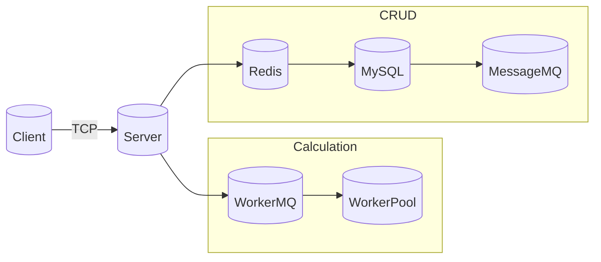

```mermaid
flowchart LR

Client[(Client)]
Server[(Server)]

MySQL[(MySQL)]
WorkerMQ[(WorkerMQ)]
MessageMQ[(MessageMQ)]
Redis[(Redis)]
WorkerPool[(WorkerPool)]

Client --TCP--> Server

Server --> WorkerMQ
subgraph Calculation [Calculation]
    WorkerMQ --> WorkerPool
end

Server --> Redis
subgraph CRUD [CRUD]
    Redis --> MySQL --> MessageMQ
end

```