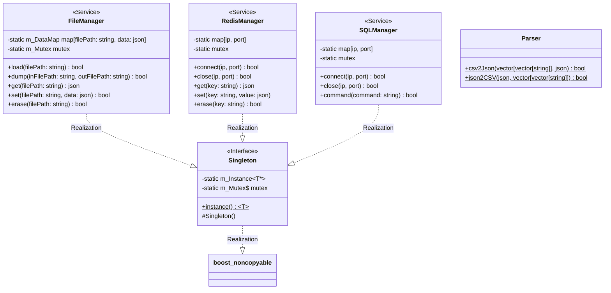

```mermaid
classDiagram
    
class boost_noncopyable

Singleton ..|> boost_noncopyable: Realization
class Singleton~T~ {
    <<Interface>>
    -static m_Instance~T*~
    -static m_Mutex$ mutex
    +instance()$ ~T~
    #Singleton()
}

FileManager ..|> Singleton: Realization
class FileManager {
    <<Service>>
    -static m_DataMap map[filePath: string, data: json]
    -static m_Mutex mutex
    +load(filePath: string) bool
    +dump(inFilePath: string, outFilePath: string) bool
    +get(filePath: string) json
    +set(filePath: string, data: json) bool
    +erase(filePath: string) bool
}

RedisManager ..|> Singleton: Realization
class RedisManager {
    <<Service>>
    -static map[ip, port]
    -static mutex
    +connect(ip, port) bool
    +close(ip, port) bool
    +get(key: string) json
    +set(key: string, value: json)
    +erase(key: string) bool
}

SQLManager ..|> Singleton: Realization
class SQLManager {
    <<Service>>
    -static map[ip, port]
    -static mutex
    +connect(ip, port) bool
    +close(ip, port) bool
    +command(command: string) bool
}

class RedisManager

class Parser {
    +csv2Json(vector[vector[string]], json)$ bool
    +json2CSV(json, vector[vector[string]])$ bool
}

```