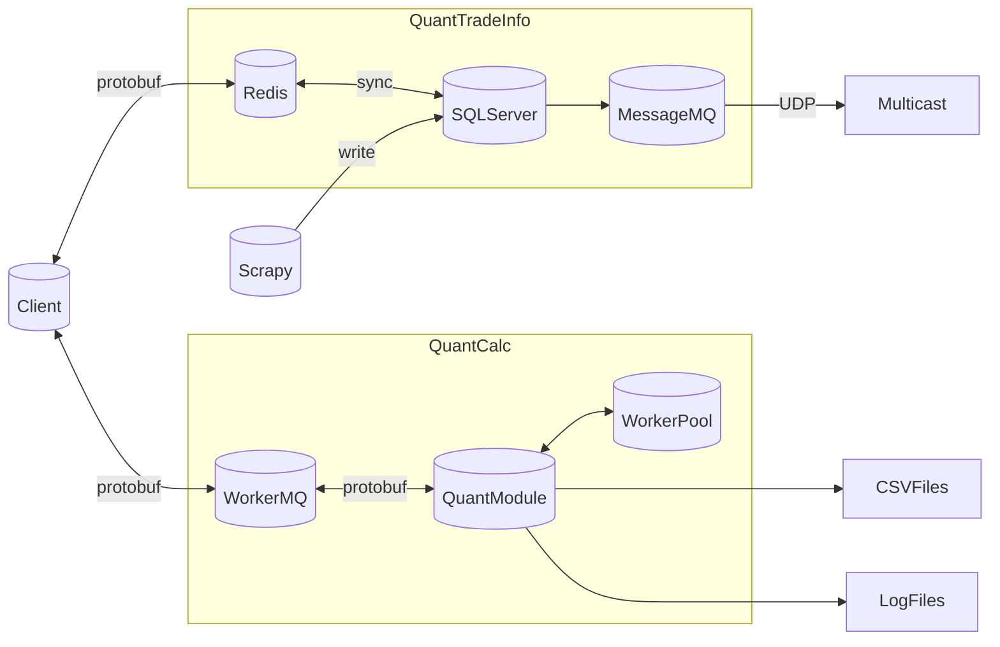

# System Architecture

```mermaid
flowchart LR

Client[(Client)]

SQLServer[(SQLServer)]
WorkerMQ[(WorkerMQ)]
MessageMQ[(MessageMQ)]
Redis[(Redis)]
WorkerPool[(WorkerPool)]
QuantModule[(QuantModule)]
Scrapy[(Scrapy)]

Client <--protobuf--> Redis
subgraph QuantTradeInfo
    Redis <--sync--> SQLServer --> MessageMQ
end
MessageMQ --UDP--> Multicast

Client <--protobuf--> WorkerMQ
subgraph QuantCalc
    WorkerMQ <--protobuf--> QuantModule <--> WorkerPool
end
QuantModule ---> CSVFiles
QuantModule ---> LogFiles

Scrapy --write--> SQLServer

click Client "./Client.md" "Open client design" 
```